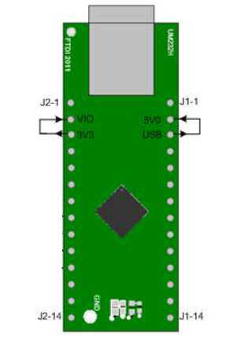

# FT232H_bitbang
This repo contains driver code to use the UM232H development module in bit-bang mode using the ftd2xx library and a librt timer.

## Install ftd2xx driver

Follow these instructions:
[AN_220_FTDI_Drivers_Installation_Guide_for_Linux-1.pdf](https://ftdichip.com/wp-content/uploads/2020/08/AN_220_FTDI_Drivers_Installation_Guide_for_Linux-1.pdf)

## Wire the UM232H module

If you are using an UM232H module wire it as shown in the image and connect it to your computer using the usb cable.

[](image.png)

In bitbang mode the pins AD0-AD7 are set low or high.


## Build using meson

Open a terminal in the same directory and build using meson:
```bat
meson setup build
```

The program is compiled using ninja:
```bat
cd build && ninja && cd ..
```
To run this program you may need unload the VCP driver first:
```bat
sudo rmmod ftdi_sio
sudo rmmod usbserial
```
The program can then be run with:
```bat
sudo ./build/ftdi_bitbang
```

## Compile using gcc

Alternatively put all the header files and main.c in the same folder and run:
```bat
gcc main.c -o ftdi_bitbang -L/usr/local/lib  -lftd2xx -lrt
```
